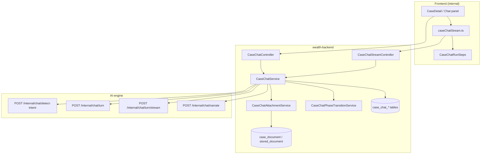
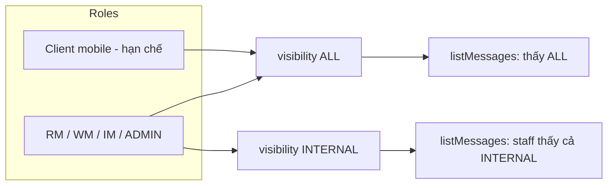
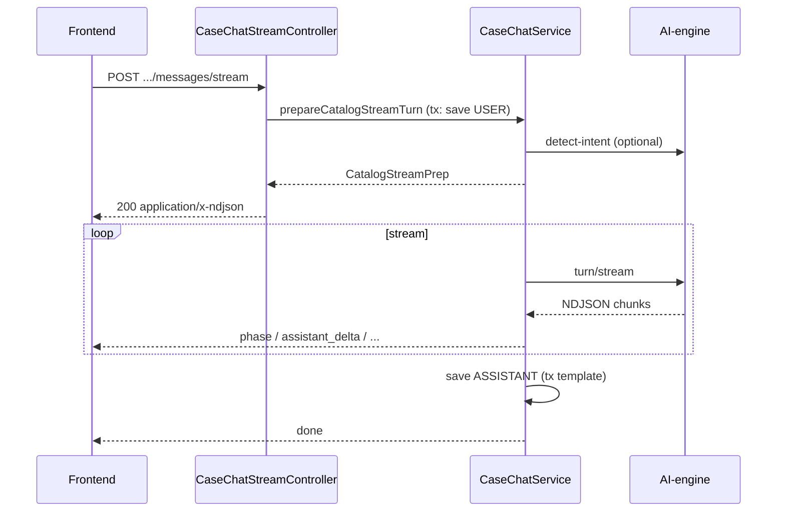

# Case Chat — Architecture Overview

Tài liệu mô tả **kiến trúc luồng chat AI** gắn với `caseId`. Chat chạy **song song** với Wealth Core lifecycle — không phải business gate, không chặn các bước RM → Client → WM → Decision → Execution.

**Tham chiếu liên quan**

| Tài liệu | Nội dung |
|----------|----------|
| `docs/BUSINESS_FLOW_ORDER_AND_ROLES.md` | Thứ tự phase chính; chat ở mục song song |
| `docs/DEVELOPMENT_GUIDE.md` | Quy tắc dev, anti-pattern, checklist merge |
| `backend/README.md` §7, §9 | Danh sách REST endpoint chat & case query |
| `backend/docs/endpoint.md` | Curl / demo chi tiết |
| `AI-engine/docs/endpoint.md` | Internal routes `/internal/chat/*` |

---

## 1. Vai trò trong hệ thống

| Khía cạnh | Mô tả |
|-----------|--------|
| **SSOT hội thoại** | Backend PostgreSQL (`case_chat_thread`, `case_chat_message`) |
| **SSOT trí tuệ** | AI-engine (assessment catalog, orchestration, LLM) — backend chỉ orchestrate |
| **Phạm vi** | 1 thread mặc định / case (`channel = CASE_CHAT`) |
| **Phase** | Mỗi turn mang `phase_code` (từ case hoặc override); intent/assessment theo phase |
| **Side effects** | Một số intent **có** thay đổi DB (đổi phase case, duyệt tài liệu, planning draft) — vẫn **không** thay thế API gate chính |

---

## 2. Sơ đồ kiến trúc (logical)



**Luồng dữ liệu một lượt chat (catalog — phổ biến nhất)**

1. Client gọi `POST /api/cases/{caseId}/chat/messages` hoặc `.../messages/stream`.
2. Backend đảm bảo thread, (tuỳ chọn) gọi **detect-intent** trên AI-engine.
3. Backend **phân nhánh** theo `intent` / heuristic (xem §5).
4. Nhánh catalog: persist USER message → gọi `POST /internal/chat/turn` (hoặc stream) → persist ASSISTANT → trả JSON hoặc NDJSON.
5. FE hiển thị message; stream path cập nhật progress steps + token delta.

---

## 3. Thành phần backend

| Package / class | Trách nhiệm |
|-----------------|-------------|
| `cases/chat/CaseChatController` | REST: thread, messages, detect-intent, attachments, clear history |
| `cases/chat/CaseChatStreamController` | `POST .../messages/stream` → NDJSON |
| `cases/chat/CaseChatService` | Orchestration: intent routing, AI calls, persist messages, stream writers |
| `cases/chat/CaseChatAttachmentService` | Upload file → `stored_document` + `case_document`; review status |
| `cases/service/CaseChatPhaseTransitionService` | Intent `CHANGE_PHASE` → cập nhật `case.phase` có guard |
| `cases/chat/stream/*` | `CaseChatRunPhase`, `CaseChatStreamEvents`, `CaseChatNdjsonWriter` |
| `integration/AiEngineChatClient` | REST sync tới AI-engine |
| `integration/AiEngineHttpStreamClient` | Proxy stream NDJSON từ AI-engine |
| `planning/service/PlanningDraftService` | Side effect planning qua chat (create/regenerate/finalize draft) |

**Nguyên tắc transaction (stream)**

- `prepareCatalogStreamTurn` chạy trong `@Transactional` — persist user message **trước** khi mở HTTP response stream.
- Phần ghi stream chạy **ngoài** transaction đang mở response (tránh lỗi committed-response).

---

## 4. Mô hình dữ liệu

### 4.1 `case_chat_thread`

| Cột | Ý nghĩa |
|-----|---------|
| `case_id` | FK → `"case"` |
| `channel` | Mặc định `CASE_CHAT` |
| Unique | `(case_id, channel)` — idempotent `GET .../chat/thread` |

### 4.2 `case_chat_message`

| Cột | Ý nghĩa |
|-----|---------|
| `sender_kind` | `USER` \| `ASSISTANT` \| `SYSTEM` |
| `actor_role` | Role JWT (RM, WM, …) hoặc `AI_ENGINE` |
| `visibility` | `ALL` (client + staff) \| `INTERNAL` (chỉ staff) |
| `phase_code` | Phase tại thời điểm gửi |
| `assessment_code` | Assessment AI-engine (catalog turn) |
| `intent_code` | Kết quả detect-intent (nếu có) |
| `body` | Nội dung hiển thị (text; có thể kèm mô tả attachment) |
| `context_snapshot` | JSONB: history snapshot, detect result, orchestration id, … |
| `ai_payload` | JSONB: raw / structured response từ AI-engine |

Flyway: `V4__case_chat.sql`, `V5__case_chat_intent_context.sql`.

### 4.3 Tài liệu đính kèm

- Upload: `POST .../chat/attachments` → file trên disk (`wealth.case-chat.upload-directory`) + metadata DB.
- Review: `PATCH .../attachments/{caseDocumentId}/status` hoặc intent `VERIFY_DOCUMENT` trong chat.
- Message có thể tham chiếu `attachmentIds` (UUID `case_document.id`).

---

## 5. Routing một lượt (turn dispatcher)

`CaseChatService.sendUserMessageAndRunAi` và `prepareCatalogStreamTurn` dùng **cùng thứ tự ưu tiên**:

```
1. detect-intent (mặc định bật; autoDetectIntent ≠ false)
2. intent == CHANGE_PHASE     → CaseChatPhaseTransitionService (+ narrate)
3. intent == VERIFY_DOCUMENT  → CaseChatAttachmentService.reviewDocument (batch)
4. resolvePlanningChatAction  → PlanningDraftService (phase PLANNING, staff)
5. looksLikePlanningDraftUserRequest → trả lời hướng dẫn (chưa persist draft)
6. default CATALOG            → postChatTurn / stream turn
```

### 5.1 Catalog turn (default)

- `assessment_code`: request body → `suggested_assessment_code` từ detect → fallback theo phase (`assessment_09` nếu `PLANNING`, else `onboarding_completeness`).
- Mỗi lượt có `orchestration_request_id` mới (UUID) — tránh reuse deterministic row trên AI-engine.
- `conversation_history`: tối đa **30** message gần nhất; INTERNAL ẩn với non-staff.
- Có thể gọi thêm **narrate** để làm plain-text reply thân thiện (`maybeNarrateChatReply`).

### 5.2 `CHANGE_PHASE` (staff only)

- Cập nhật `WealthCase.phase` qua `CaseChatPhaseTransitionService`.
- Target: `target_phase_code` từ AI, tên phase trong message, hoặc “next phase”.
- **Guards**: chỉ tiến **1 bước** trong catalog; không lùi; không nhảy cóc; prerequisite theo phase hiện tại (client ACTIVE, profile task, plan approved, …).
- Kết quả `mode`: `APPLIED` \| `BLOCKED` \| `NOOP` — assistant message narrate kết quả.

### 5.3 `VERIFY_DOCUMENT` (staff only)

- `verify_action` từ detect (mặc định `VERIFIED`).
- Nếu không gửi `attachmentIds` → duyệt tất cả `case_document` **PENDING** của case.

### 5.4 Planning qua chat (staff, case phase `PLANNING`)

| Heuristic / action | Hành vi |
|--------------------|---------|
| `CREATE_DRAFT` | Tạo draft từ template ACTIVE (WM/ADMIN) hoặc trả draft hiện có |
| `REGENERATE_DRAFT` | `PlanningDraftService.regenerate` |
| `FINALIZE_DRAFT` | `PlanningDraftService.finalizeDraft` |
| `GET_DRAFT_STATUS` | Đọc trạng thái draft mới nhất |

Không thay thế REST `/cases/{id}/planning/drafts` — chat là **shortcut** cho demo/ops.

---

## 6. API surface (backend)

| Method | Path | Mô tả |
|--------|------|--------|
| GET | `/api/cases/{caseId}/chat/thread` | Get-or-create thread |
| GET | `/api/cases/{caseId}/chat/messages?threadId=` | List (lọc INTERNAL) |
| POST | `/api/cases/{caseId}/chat/messages` | Sync turn → JSON |
| POST | `/api/cases/{caseId}/chat/messages/stream` | NDJSON stream |
| POST | `/api/cases/{caseId}/chat/detect-intent` | Intent only (không persist) |
| POST | `/api/cases/{caseId}/chat/attachments` | Multipart upload |
| PATCH | `/api/cases/{caseId}/chat/attachments/{id}/status` | Review thủ công |
| DELETE | `/api/cases/{caseId}/chat/messages?threadId=` | Xóa history (staff) |

**Auth:** JWT Bearer; roles `RM`, `WM`, `IM`, `ADMIN` cho hầu hết chat ops; `INTERNAL` visibility chỉ staff. Chi tiết matcher: `SecurityConfig.java`.

---

## 7. Streaming (NDJSON)

### 7.1 Hai mode gọi API

| Mode | Endpoint | Khi dùng |
|------|----------|----------|
| Sync | `POST .../messages` | Demo đơn giản, test curl |
| Stream | `POST .../messages/stream` | UI production (`CaseDetail`) — progress + token |

### 7.2 `StreamTurnKind`

| Kind | Stream behavior |
|------|-----------------|
| `CATALOG` | Proxy AI-engine `turn/stream`; emit `assistant_delta`, `catalog_turn_complete` |
| `CHANGE_PHASE` | Phase events + narrate stream |
| `VERIFY_DOCUMENT` | Document phases + narrate |
| `PLANNING_ACTION` | Local steps (`DB_UPDATE`) + assistant text cố định |

### 7.3 Event contract (backend ↔ frontend)

Backend enum `CaseChatRunPhase` ↔ FE `CHAT_RUN_PHASE_CODES` trong `frontend/src/domain/caseChatRunEvents.ts`:

`ROUTING`, `SEARCH`, `VERIFY`, `REASON`, `THINKING`, `DOCUMENT_PROCESS`, `DB_UPDATE`

Các dòng NDJSON chính:

| `type` | Ý nghĩa |
|--------|---------|
| `phase` | Tiến trình (code + labelVi tùy chọn) |
| `assistant_delta` | Chunk text assistant |
| `catalog_turn_complete` | Kết thúc catalog stream (payload + text) |
| `done` | `userMessageId`, `assistantMessageId` |
| `error` | Lỗi có kiểm soát |

Consumer: `frontend/src/services/caseChatStream.ts`, UI steps: `CaseChatRunSteps.tsx`.

---

## 8. Tích hợp AI-engine

| Backend call | AI-engine route |
|--------------|-----------------|
| `AiEngineChatClient.postDetectIntent` | `POST /internal/chat/detect-intent` |
| `AiEngineChatClient.postChatTurn` | `POST /internal/chat/turn` |
| `AiEngineChatClient.postNarrate` | `POST /internal/chat/narrate` |
| `AiEngineHttpStreamClient` | `POST /internal/chat/turn/stream`, `.../narrate/stream` |

**Cấu hình** (`application.yml`):

- `wealth.ai-engine.base-url` (mặc định `http://localhost:8010`)
- `wealth.ai-engine.internal-token` → header `X-Internal-Token` (phải khớp AI-engine)

Admin cấu hình catalog phase/assessment/LLM qua `/api/admin/ai-engine/*` (không thuộc package chat nhưng ảnh hưởng hành vi turn).

---

## 9. Bảo mật & visibility



- Staff roles: `CaseChatService.STAFF_ROLES`.
- `primaryRole(authentication)`: lấy role đầu tiên từ JWT authorities.
- Clear history, CHANGE_PHASE, VERIFY_DOCUMENT, planning actions: **staff only**.

---

## 10. Frontend (tham chiếu)

| File | Vai trò |
|------|---------|
| `frontend/src/pages/internal/CaseDetail.tsx` | Panel chat, gọi stream + reload messages |
| `frontend/src/services/caseChatStream.ts` | Parse NDJSON, batch text RAF |
| `frontend/src/domain/caseChatRunEvents.ts` | Type + label phase tiếng Việt |
| `frontend/src/components/CaseChatRunSteps.tsx` | UI tiến trình lượt |

---

## 11. Sơ đồ sequence — catalog stream (rút gọn)



---

## 12. Mở rộng / lưu ý vận hành

- **Không gate lifecycle:** Approve plan, discovery check, execution vẫn qua API riêng (`ClientDecisionGateService`, `DiscoveryReadinessService`, …).
- **Phase chat vs phase case:** Chat có thể *đề xuất* đổi phase (intent); guard nghiệp vụ nằm ở `CaseChatPhaseTransitionService`.
- **Lịch sử AI:** `HISTORY_WINDOW = 30`, body truncate `MAX_BODY_CHARS_FOR_CONTEXT = 4000` khi build history.
- **Upload:** `wealth.case-chat.max-file-size-bytes` (mặc định 25MB).
- **Đồng bộ contract:** Khi thêm `CaseChatRunPhase` hoặc event type mới — cập nhật cả Java enum và `caseChatRunEvents.ts`.

---

## 13. File map (quick navigation)

```
backend/src/main/java/com/backend/wealth/
  cases/chat/
    CaseChatController.java
    CaseChatStreamController.java
    CaseChatService.java
    CaseChatAttachmentService.java
    model/CaseChatThread.java, CaseChatMessage.java
    stream/CaseChatRunPhase.java, CaseChatStreamEvents.java, CaseChatNdjsonWriter.java
  cases/service/CaseChatPhaseTransitionService.java
  integration/AiEngineChatClient.java, AiEngineHttpStreamClient.java

backend/src/main/resources/db/migration/
  V4__case_chat.sql
  V5__case_chat_intent_context.sql

frontend/src/
  domain/caseChatRunEvents.ts
  services/caseChatStream.ts
  pages/internal/CaseDetail.tsx
  components/CaseChatRunSteps.tsx
```
