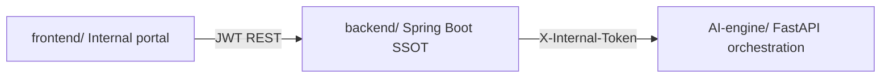
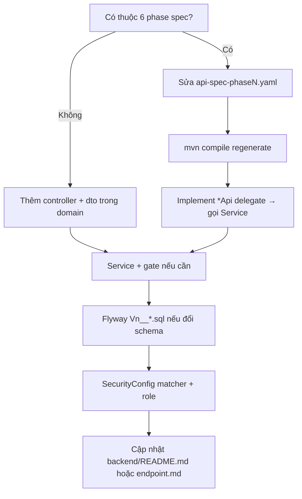

# SmartWealth — Development Guide

Hướng dẫn phát triển **toàn repo** (backend, frontend, AI-engine): giúp onboard nhanh, **không phá kiến trúc**, và biết **đặt code ở đâu** khi thêm tính năng.

> Đọc trước khi mở PR lớn. Chi tiết từng vùng nằm ở các tài liệu chuyên đề bên dưới — guide này là **luật chung** + **checklist**.

---

## Mục lục tài liệu

| Tài liệu | Khi nào đọc |
|----------|-------------|
| **`docs/DEVELOPMENT_GUIDE.md`** (file này) | Quy tắc chung, nơi đặt code, anti-pattern |
| `docs/BUSINESS_FLOW_ORDER_AND_ROLES.md` | Thứ tự bước nghiệp vụ & role (gate chính) |
| `docs/CASE_CHAT_ARCHITECTURE.md` | Chat AI: routing intent, stream, SSOT |
| `docs/ONBOARDING_INTEGRATION_FLOW.md` | Demo end-to-end + curl + workflow AI-engine |
| `backend/README.md` | Endpoint theo phase, Flyway, package layout |
| `backend/docs/endpoint.md` | Curl backend từng API |
| `AI-engine/docs/CODING_GUIDE.md` | Orchestrator, assessment, agent trong AI-engine |
| `AI-engine/docs/endpoint.md` | Internal routes AI-engine |
| `frontend/README.md` | Cấu trúc FE internal portal |

---

## 1. Bản đồ monorepo



| Thư mục | Trách nhiệm | Không làm ở đây |
|---------|-------------|------------------|
| **`backend/`** | Lifecycle case, persistence, gate nghiệp vụ, proxy AI | Gọi LLM trực tiếp; lưu catalog assessment runtime |
| **`AI-engine/`** | Assessment, orchestration, prompt, LLM adapter | Cập nhật `case.phase`, approve plan, execution |
| **`frontend/`** | UI RM/WM/IM/Admin + mobile demo pages | Business gate; gọi AI-engine thẳng (trừ optional Gemini local) |
| **`frontend-openapi/`** | Portal đối tác (tách bạch) | Logic core wealth |

**Trục dữ liệu:** mọi luồng chính xoay quanh **`case.id`** (và `client.id` gắn case). Client là **sole decision maker** cho recommendation; execution chỉ sau plan **APPROVED**.

---

## 2. Nguyên tắc kiến trúc (bắt buộc nhớ)

### 2.1 Phân tầng trách nhiệm

| Tầng | Backend | AI-engine |
|------|---------|-----------|
| **Quyết định / gate** | `*Service` + `BusinessException` | Policy trong orchestrator, không bypass backend gate |
| **Lưu trữ SSOT** | PostgreSQL + JPA `model` | Postgres catalog / orchestration request (AI domain) |
| **API công khai** | REST + Spring Security roles | `/internal/*` — chỉ backend (hoặc tool ops) |
| **UI** | — | — (FE gọi backend) |

### 2.2 Hai loại API trên backend

| Loại | Cách tạo | Ví dụ |
|------|----------|--------|
| **OpenAPI-first (Wealth Core 6 phase)** | Sửa `api-spec-phase*.yaml` → `mvn compile` → implement `*Api` | `POST /api/cases`, `POST /clients/{id}/plans` |
| **Manual REST** | `@RestController` + DTO trong package domain | Chat, discovery admin, planning drafts, workflow |

**Quy tắc:**

- Luồng **lifecycle chuẩn** (RM → Client → WM → Decision → IM → Admin): **ưu tiên OpenAPI** + service gate có sẵn.
- Tính năng **nội bộ / admin / chat / discovery config**: controller thủ công + `@Tag` Swagger nếu cần.
- **Không** trộn logic gate vào controller — controller chỉ bind HTTP, gọi service.

### 2.3 Business gate — một nơi, nhiều caller

Gate phải nằm trong **service chuyên trách**, không copy điều kiện sang chat/FE/workflow.

| Gate | Service (tham chiếu) |
|------|----------------------|
| Discovery → Planning | `DiscoveryReadinessService` |
| WM tạo plan | `WmPlanningService.requireCaseReadyForPlanning` |
| Client approve | `ClientDecisionGateService` |
| Execution instruction | `ExecutionLifecycleService` (plan APPROVED) |
| Phase case (chat) | `CaseChatPhaseTransitionService` (forward-only + prerequisite) |
| AI workflow phase | `AiGateValidationService` |

**Anti-pattern:** đổi `case.phase` hoặc `plan.status` trực tiếp trong controller, FE, hoặc AI-engine.

### 2.4 Chat ≠ thay thế gate

- Chat có thể **gợi ý** hoặc **side-effect** (đổi phase, verify doc, planning draft) nhưng **không** thay:
  - `POST /cases/{id}/discovery/check`
  - `POST /recommendations/{id}/decision`
  - API execution / admin ops chính thức
- Chi tiết routing turn: `docs/CASE_CHAT_ARCHITECTURE.md` §5.

---

## 3. Backend — đặt code ở đâu

### 3.1 Package layout (mỗi domain)

```
com.backend.wealth.<domain>/
  model/          # JPA entity
  repository/     # Spring Data
  service/        # Business logic, @Transactional
  controller/     # REST (nếu không dùng OpenAPI delegate)
  dto/            # Request/response thủ công
  constants/      # Status strings (tránh magic string rải rác)
  config/         # @Configuration module (stub mở rộng)
```

**OpenAPI DTO** nằm ở `com.backend.wealth.openapi.model` (generated — **không sửa tay**).

### 3.2 Luồng thêm tính năng mới



### 3.3 Exception & HTTP

- `NotFoundException` — 404, entity không tồn tại.
- `BusinessException` — 400, vi phạm rule nghiệp vụ (message rõ cho FE).
- `GlobalExceptionHandler` map sang `CoreErrorResponse` — không trả stack trace ra client.

### 3.4 Tích hợp AI-engine

- Chỉ qua `com.backend.wealth.integration.*` (`AiEngineChatClient`, `AiEngineWorkflowClient`, …).
- Cấu hình: `wealth.ai-engine.base-url`, `wealth.ai-engine.internal-token`.
- **Không** nhúng API key LLM vào backend service ngoài integration layer.

### 3.5 Database

- Migration: `backend/src/main/resources/db/migration/V{n}__mô_tả_snake.sql` — **chỉ tăng version**, không sửa file đã merge.
- Bảng `"case"` là reserved word → entity `WealthCase` với `@Table(name = "\"case\"")`.
- JSONB cho payload linh hoạt (`content`, `ai_payload`, `context_snapshot`) — vẫn validate ở service khi đọc.

---

## 4. Frontend — đặt code ở đâu

### 4.1 Cấu trúc

| Thư mục | Dùng cho |
|---------|----------|
| `pages/internal/` | Màn hình RM/WM/IM/Admin |
| `pages/mobile/` | Luồng client demo |
| `services/` | Gọi API backend (fetch, stream parser) |
| `domain/` | Type contract đồng bộ backend (vd. `caseChatRunEvents.ts`) |
| `components/` | UI tái sử dụng |
| `auth/` | JWT / guard route |

### 4.2 Quy tắc FE

- **Không** implement gate nghiệp vụ chỉ bằng UI (disable nút là UX, không thay backend).
- API base URL qua env / proxy Vite — không hardcode token trong source.
- Chat stream: dùng `services/caseChatStream.ts`; event `type`/`code` phải khớp `CaseChatRunPhase` (Java) — xem §6.

### 4.3 Thêm màn hình mới

1. Page trong `pages/internal/` hoặc `mobile/`.
2. Service function gọi endpoint backend (một file service / domain API).
3. Route trong router app.
4. Nếu role-specific: guard tương tự màn hình hiện có (`auth/`).

---

## 5. AI-engine — ranh giới với backend

| Việc | AI-engine | Backend |
|------|-----------|---------|
| Chọn assessment / agent / prompt | ✓ | Chỉ truyền `assessment_code`, `phase_code` |
| Persist case / plan / task | ✗ | ✓ |
| Chat turn / detect-intent | ✓ (internal) | Orchestrate + persist messages |
| Catalog admin (phase, interaction, LLM) | DB + API internal seed | Admin UI qua `/api/admin/ai-engine/*` |

Mở rộng assessment: đọc `AI-engine/docs/CODING_GUIDE.md` §6 — **không** sửa backend gate khi thêm assessment trừ khi có rule wealth mới.

---

## 6. Đồng bộ contract (tránh lệch FE ↔ BE)

| Contract | Java | TypeScript |
|----------|------|------------|
| Chat stream phases | `CaseChatRunPhase` | `CHAT_RUN_PHASE_CODES` trong `caseChatRunEvents.ts` |
| Chat stream events | `CaseChatStreamEvents` | `ChatRunStreamEvent` |

**Khi thêm phase/event stream:** sửa **cả hai** + cập nhật `docs/CASE_CHAT_ARCHITECTURE.md` §7.

**OpenAPI wealth core:** sau khi đổi spec, regenerate và cập nhật FE nếu có client generated (hoặc DTO tay trong `services/`).

---

## 7. Security & roles

| Role | Ý nghĩa ngắn |
|------|----------------|
| `RM` | Tạo case, discovery check |
| `WM` | Planning, recommendations |
| `IM` | Execution instructions |
| `ADMIN` | Ops, catalog, users |
| Client mobile | Một số route `permitAll` (register, profile, decision) |

- Mọi endpoint mới: thêm matcher trong `SecurityConfig.java` — mặc định `.anyRequest().denyAll()`.
- Chat `INTERNAL` visibility: chỉ staff đọc được khi list messages.

---

## 8. Anti-pattern (tránh)

| ❌ Không làm | ✓ Thay vào |
|-------------|-----------|
| Gọi AI-engine từ frontend production | Gọi backend proxy |
| Sửa file generated OpenAPI model | Sửa YAML + compile lại |
| Copy điều kiện “case READY” vào nhiều class | Gọi `DiscoveryReadinessService` / `WmPlanningService` |
| Approve plan trong chat mà không qua decision API | `ClientDecisionGateService` |
| Persist assistant message trước khi stream xong (catalog) | Theo pattern `prepareCatalogStreamTurn` → stream → save assistant |
| Thêm intent chat bypass guard phase | Mở rộng `CaseChatPhaseTransitionService` có test guard |
| Magic string status rải rác | `constants/PlanStatuses`, `CaseStatuses`, … |
| Flyway sửa migration cũ trên nhánh shared | Migration `V{n+1}__...` mới |

---

## 9. Checklist trước khi merge

- [ ] Gate nghiệp vụ nằm trong **service** đúng domain, có message `BusinessException` rõ.
- [ ] `SecurityConfig` đã khai báo path + HTTP method + role.
- [ ] Flyway (nếu có) chạy sạch trên DB local; không đổi file `V*` cũ.
- [ ] OpenAPI: `mvn compile` thành công nếu đụng spec.
- [ ] Chat/stream: không phá thứ tự dispatcher; transaction/stream tách như hiện tại.
- [ ] FE: không leak secret; stream parser vẫn parse được event mới.
- [ ] Cập nhật doc: `backend/README.md` (endpoint) hoặc `docs/*` nếu đổi hành vi kiến trúc.
- [ ] Demo flow vẫn khớp `docs/BUSINESS_FLOW_ORDER_AND_ROLES.md` (hoặc cập nhật bảng thứ tự).

---

## 10. Chạy local (tối thiểu)

| Service | Lệnh / URL |
|---------|------------|
| PostgreSQL | Khớp `backend/src/main/resources/application.yml` |
| Backend | `cd backend && mvn spring-boot:run` → `http://localhost:8090` |
| AI-engine | `cd AI-engine && uvicorn app.main:app --port 8010` (xem README AI-engine) |
| Frontend | `cd frontend && npm run dev` → `http://localhost:3000` |

Biến quan trọng:

- Backend: `WEALTH_AI_ENGINE_INTERNAL_TOKEN` khớp AI-engine internal token.
- FE: proxy/API base trỏ backend 8090.

Swagger backend: `http://localhost:8090/swagger-ui.html`

---

## 11. Gợi ý lộ trình người mới (3 ngày)

| Ngày | Việc |
|------|------|
| **1** | Đọc `BUSINESS_FLOW_ORDER_AND_ROLES.md` + chạy 1 lượt `ONBOARDING_INTEGRATION_FLOW.md` |
| **2** | Đọc `backend/README.md`; trace `RmEntryController` → `DiscoveryReadinessService` → `WmPlanningService` |
| **3** | Đọc `CASE_CHAT_ARCHITECTURE.md`; gửi 1 message sync + 1 stream trên Case Detail UI |

Sau đó: deep dive domain bạn sở hữu (discovery / planning / chat) theo package tương ứng.

---

## 12. Liên hệ mã nguồn “golden path”

| Chủ đề | File bắt đầu đọc |
|--------|------------------|
| Tạo case | `rm/controller/RmEntryController.java` |
| Discovery ready | `cases/service/DiscoveryReadinessService.java` |
| WM plan | `plan/service/WmPlanningService.java` |
| Planning draft (template) | `planning/service/PlanningDraftService.java` |
| Client decision | `decision/service/ClientDecisionGateService.java` |
| Execution | `execution/service/ExecutionLifecycleService.java` |
| Chat turn | `cases/chat/CaseChatService.java` |
| Security | `config/SecurityConfig.java` |
| AI call | `integration/AiEngineChatClient.java` |

---

*Tài liệu này là living doc — khi thêm pattern kiến trúc mới (ví dụ event bus, API version 2), cập nhật section tương ứng thay vì tạo guide rời rạc.*
